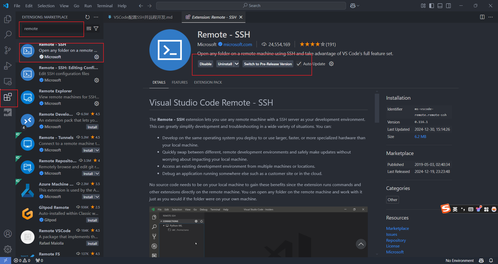
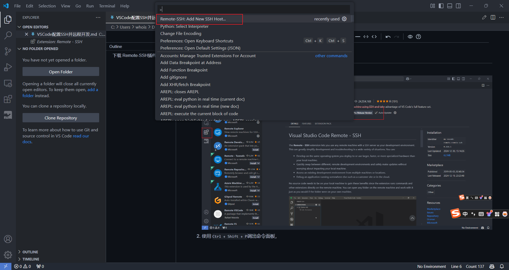
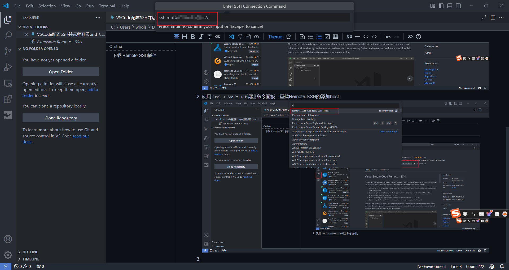
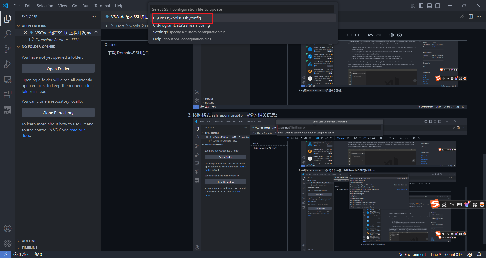
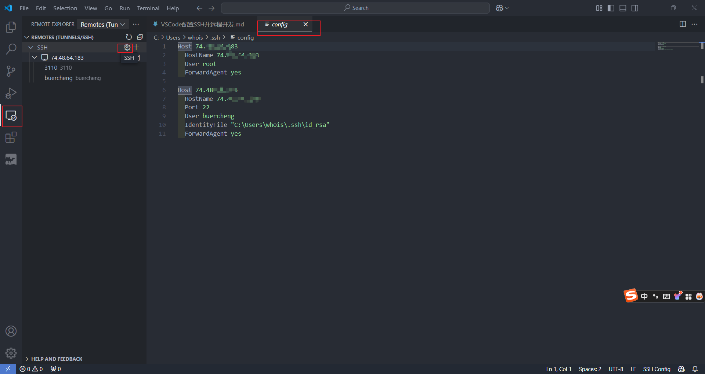
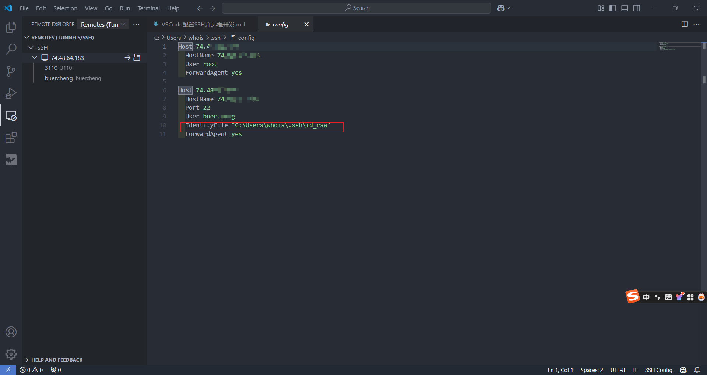

# 下载 Remote-SSH插件

1. 在插件市场下载Remote-SSH插件;
   
2. 使用 `Ctrl + Shift + P`调出命令面板，查找Remote-SSH的添加host；
   
3. 按照格式 `ssh username@ip -A`输入相关信息，按下回车，选择配置文件；
   
   
4. 按图示可查看配置信息；
   
5. 点击右侧箭头可进行连接。

# 免密登录

1. 没有密钥对时，需要生成密钥对；打开Gitbash生成；
   `ssh-keygen -t rsa -b 4096 -C "your_email@example.com"`
2. 在配置文件里添加密钥路径；
   
3. 将公钥推送到服务器；
   `ssh-copy-id username@remote_host`
4. 验证是否能免密连接。

# 使用code命令打开服务器远程文件

1. 找到服务器上的code可执行文件，类似路径：
   `/home/buercheng/.vscode-server/cli/servers/Stable-fabdb6a30b49f79a7aba0f2ad9df9b399473380f/server/bin/remote-cli`
2. 将上述路径添加到环境变量；
3. 打开 ` ~/.bashrc`,添加：

   ```bash
   #VSCode
   export PATH=/home/buercheng/.vscode-server/cli/servers/Stable-fabdb6a30b49f79a7aba0f2ad9df9b399473380f/server/bin/remote-cli:$PATH
   ```
4. 执行 `source ~/.bashrc .`
